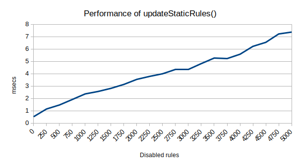

# Declarative Net Request: disable individual static rules (Extension to check updateStaticRules performance)

The extension checks the updateStaticRules() performance by changing the number of disabled rules in a static ruleset:
(no disabled rules ~ 5000 disabled rules)

It checks the method call performance 100 times for each case, and print the average result to the console.error

## How to use this extension

- Launch Chromium.
- Go to `More tools > Extensions`
- Click on `Load unpacked`
- Select the `extension` folder on this project.
- The output of the extension will be shown as log messages in the extension's `Errors` section.

## Test Result

(Local release build with [CL 3954955](https://crrev.com/c/3954955/9), [CL 3999643](https://crrev.com/c/3999643/3), [CL 3989814](https://crrev.com/c/3989814/7) and [CL 4005612](https://crrev.com/c/4005612/1))
